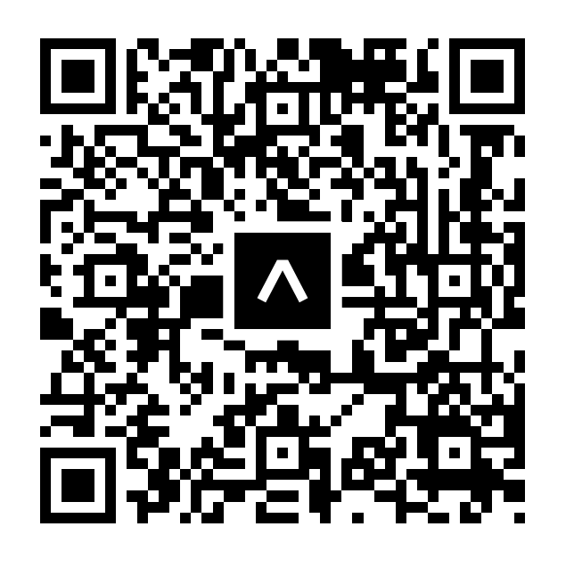

 

 
<h1 align=center>InstaFood</h1>
 
- Using Expo Client App (Expo Go) and scan this QR code: 
<!--  -->

 
- API URL: https://hacktiv8-instafood.herokuapp.com 
- API Docs: [see here](api_docs.md)
